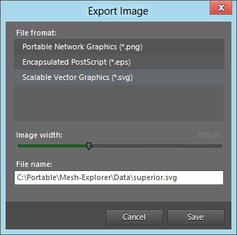

# Export a mesh to PNG, EPS or SVG format

You can use the _Export Image_ entry in the _File_ menu to save your mesh to one of the following graphic formats:
* Portable Network Graphics (.png)
* Encapsulated PostScript (.eps)
* Scalable Vector Graphics (.svg)
Choose the desired width of the image (height will be set automatically to fit the mesh dimensions) and a file name, then click _Save_ and the image will be saved to the given path.

